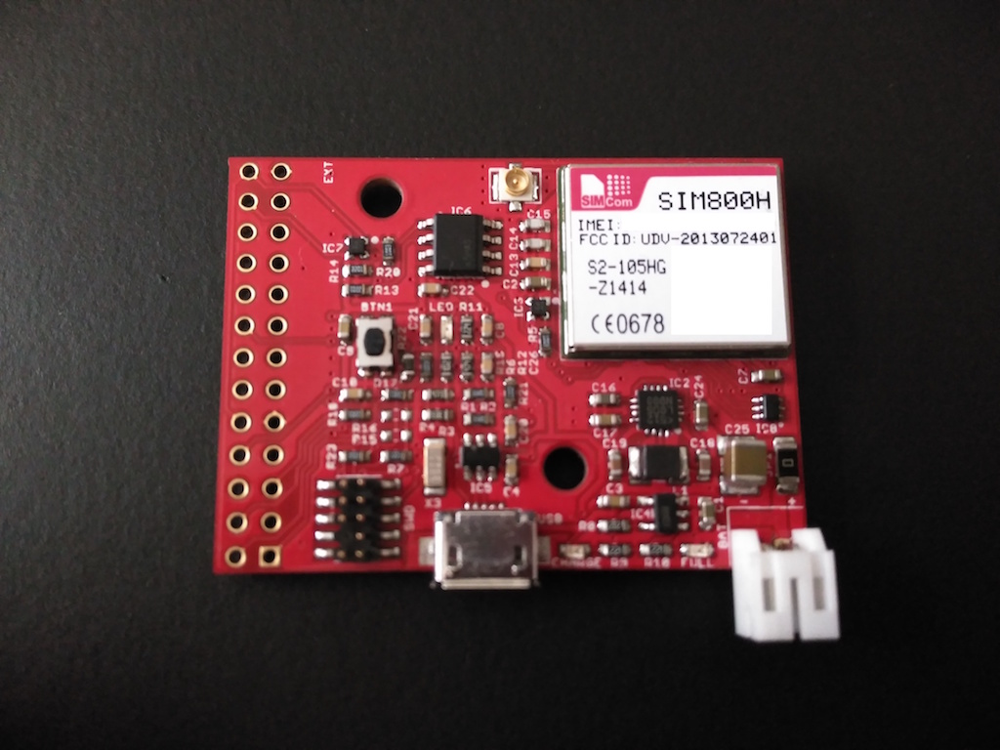
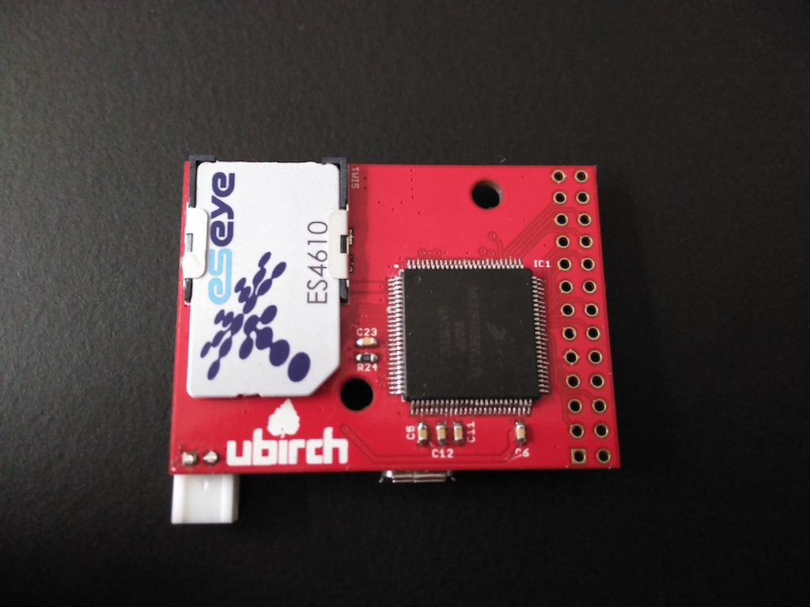

# ubirch#1 r0.2 board specific implementation

This is the ubirch#1 board revision 0.2. It has built in a single-color LED, an extra [Atmel ECC](http://www.atmel.com/products/security-ics/cryptoauthentication/ecc-256.aspx)
chip as well as a cell phone chip ([SIM800H/SIM800C](http://simcomm2m.com/En/module/detail.aspx?id=74)

* currently programmable by JTAG (SWD)
* serial debug console is configured on PTB16 (RX) )and PTB17 (TX)

## Connectors

Debug console output can be found on pins 6 (RX) and 7 (TX). If the SIM800H chip is on the bottom right
corner of the board, the pins are as follows:

```
2  4  6  8  10 12 14 16 18 20 22 24 26
o  o  o  o  o  o  o  o  o  o  o  o  o
⚀  o  o  o  o  o  o  o  o  o  o  o  o
1  3  5  7  9  11 13 15 17 19 21 23 25
```

The pin configuration is as follows:

```
 1 = A1         PTB2   |  2 = A2          PTB3
 3 = D1         PTB9   |  4 = I2C_SCL     PTB10
 5 = I2C_SDA    PTB11  |  6 = UART_RX     PTB16
 7 = UART_TX    PTB17  |  8 = T1          PTB18
 9 = GND               | 10 = switchable  VDD
11 = T2         PTB19  | 12 = SPI2_CS0    PTB20
13 = SPI2_SCK   PTB21  | 14 = SPI2_MOSI   PTB22
15 = SPI2_MISO  PTB23  | 16 = UART2_RTS   PTC1
17 = SPI0_CS4   PTC0   | 18 = UART2_CTS   PTC2
19 = UART2_RX   PTC3   | 20 = UART2_TX    PTC4
21 = SPI0_SCK   PTC5   | 22 = SPI0_MOSI   PTC6
23 = SPI0_MISO  PTC7   | 24 = permanent   VDD
25 = GND               | 26 = switchable  VDD
```

* external I2C is the I2C2
* internal connection to the ATECC chip is I2C0




