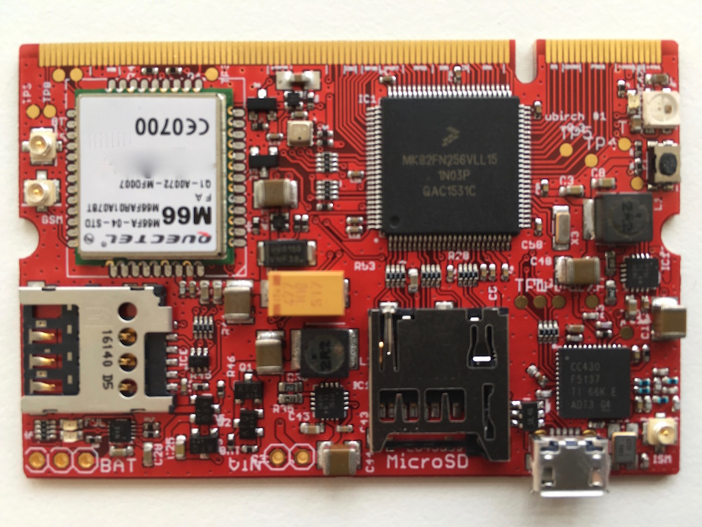
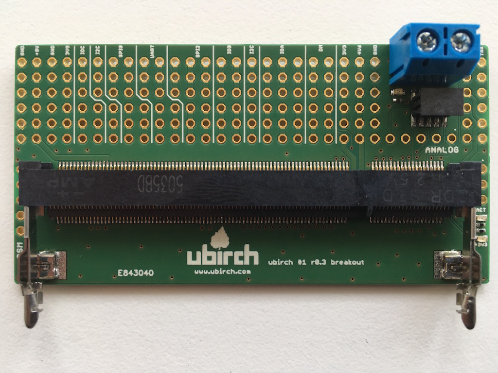
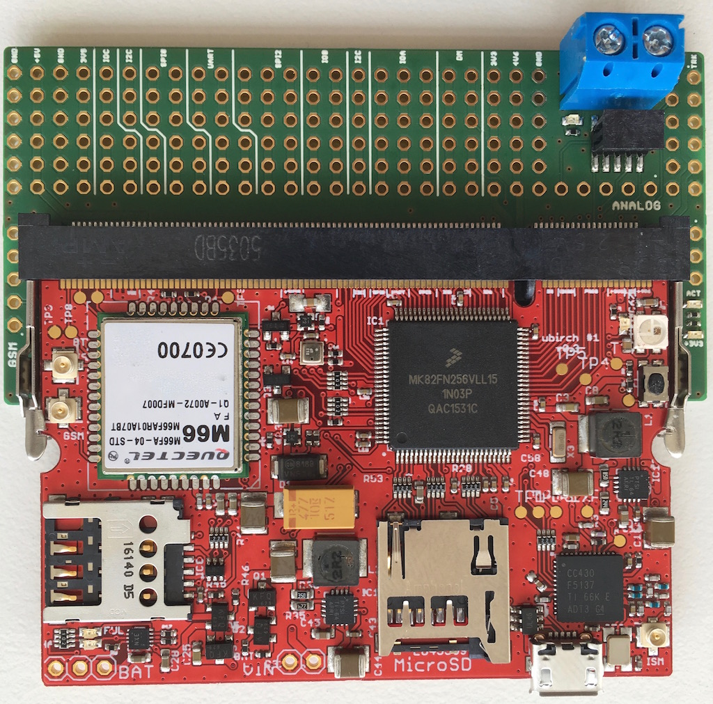

# ubirch#1 r0.3 board specific implementation

This is the ubirch#1 board revision 0.3.
This board contains almost the same components as the r0.2 with a different cell-chip 
([Quectel M66](http://www.quectel.com/product/prodetail.aspx?id=73)) and no extra ECC chip. This board is minimal with 
an extra environment sensor. A speciality of this board is the SO-DIMM header on one side. An extra adapter is
required to access the SWD port and other ports that were available as pin headers bevore. This board
has an SDHC slot and features a sub-1GHz RF module.

* programmable via USB or JTAG (SWD, JLink Debug Probe)
* serial debug console is configured on PTB16 (RX) and PTB17 (TX)

## Flashing

Entering bootloader mode:
1. __Initial__ (necessary once): The board must be reset into bootloader mode. This is done by removing the USB/Power, then pressing
the button on-board (keep pressed) and re-inserting the USB cable. Now the board is in bootloader mode.
2. __Firmware__: After flashing using the latest firmware entering the bootloader mode is just a
matter of pressing the button once.

If you use the [cmake build toolchain](https://github.com/ubirch/ubirch-arm-toolchain), the `-flash` target for your
project will be configured to use the `blhost` tool coming with the toolchain to flash directly via USB.

The commands it executes are:

- `blhost -u -- flash-erase-all`
- `blhost -u -- write-memory 0x0 target-executable.bin`
- `blhost -u -- reset`

These commands, erase flash, write the binary and reset the board.

## Connectors

[TBD]

## Images

### Board Upper Side

### Board Adapter

### Dev Adapter Combined w/ Board

